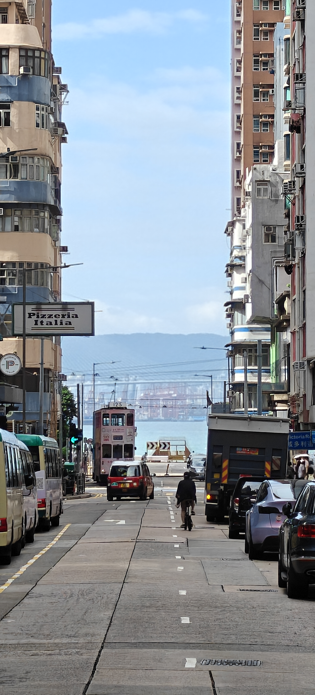
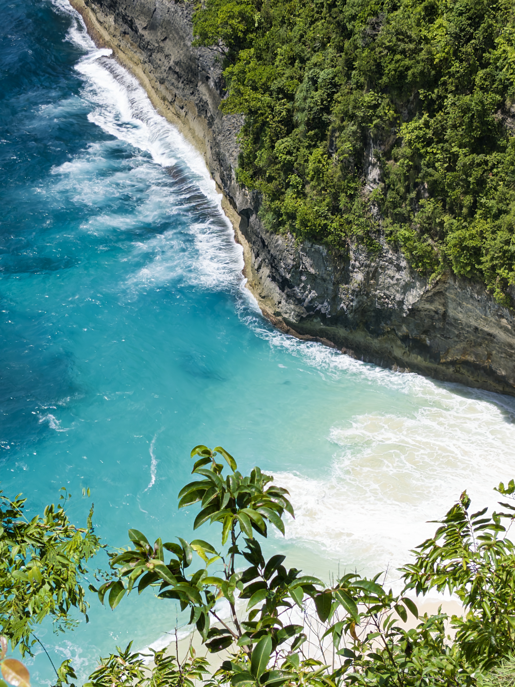
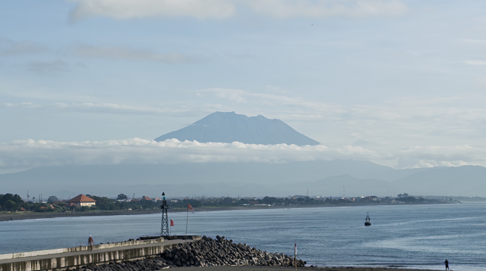
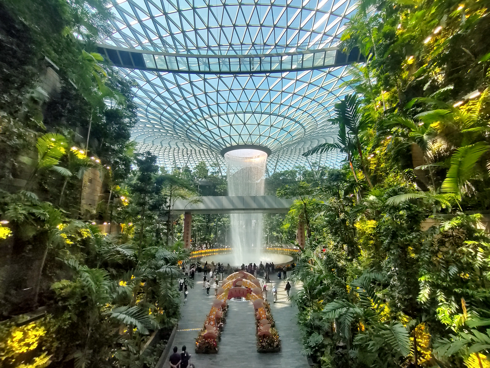
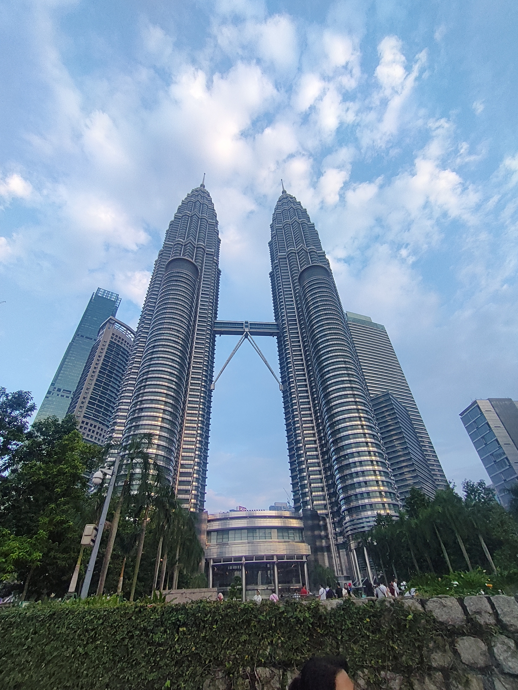

# TRAVELS

Haozhuo Zhang has always been driven by an enduring curiosity about the world. Travel, to him, is more than movement across borders—it is a way of understanding cultures, landscapes, and the people who shape them. With a dream of reaching every corner of the planet, he continues to collect moments, stories, and perspectives along the way.
Below are some snapshots and records from his journeys, each marking a step in his ongoing exploration of the world.

## Countries Visited

### Asia

#### Mainland China
Haozhuo now lives in.

#### Macao SAR, China

	<figure>
		
	</figure>

#### HongKong SAR, China

	<figure>
		
	</figure>

#### Taiwan, China

	<figure>
		
	</figure>

#### Japan

	<figure>
		
	</figure>

#### Indonesia

	<figure>
		
	</figure>
    <figure>
		
	</figure>

#### Singapore

	<figure>
		
	</figure>

#### Malaysia

	<figure>
		
	</figure>

---

*Continuously updated... Exploring more of the world*

